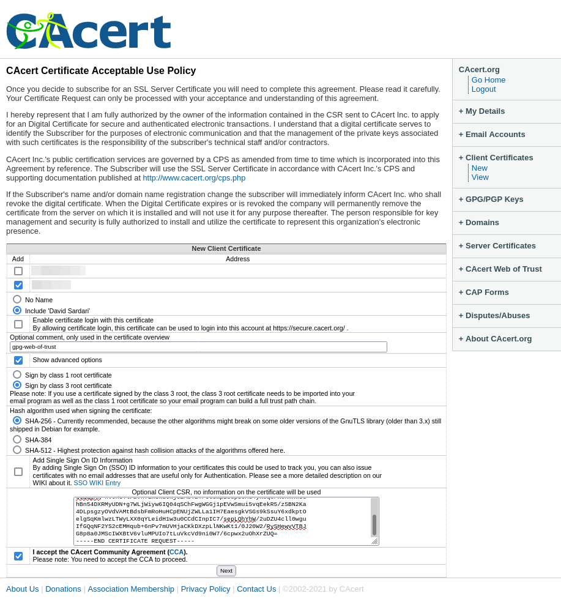
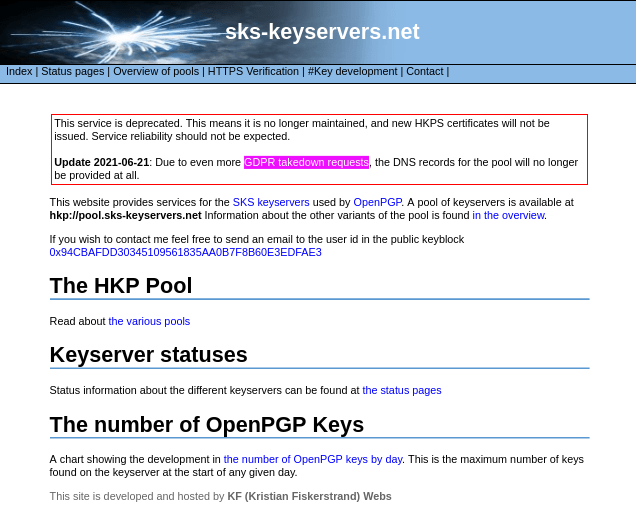

# (WIP) GnuPG Web of Trust (WIP)

The following outlines a "new" way to realise Web of Trust for GnuPG. The limitations of traditional Web of Trust is described under ["Background information"](#background-information). This new approach consist of:

1. Creation of a class 3 S/MIME key pair signed by [CAcert](http://www.cacert.org)
2. Creation and publication of a detached S/MIME signature for your GnuPG public key
3. Retrieval and signature verification by your communication partner:

```
$ bash s2g.sh pubkey.asc.pkcs7

Checks passed 🎉 S/MIME certificate:
  - Not expired ✔
  - Not revoked (CRL/OCSP) ✔
  - Class 3 (person identity verified) ✔
  - Signed by CAcert ✔
  - Subject and GnuPG UID match ✔

S/MIME certificate subject:
  - CommonName: David Sardari
  - E-Mail:     david.sardari@example.de

GnuPG UID(s):
  - David Sardari <david.sardari@example.org>
  - David Sardari <david.sardari@example.de>
  - David Sardari <david.sardari@example.eu>

GnuPG public key retrieval succeeded over these channels:
  - DANE
  - WKD
  - hkps://keys.openpgp.org

Feel free to import with:
  gpg --import "/tmp/tmp.rkEDaMITRr.asc"

```

## Creation of class 3 S/MIME key pair

First and foremost, you need a class 3 S/MIME certificate signed by [CAcert](http://www.cacert.org):

1. You have to create your private key for S/MIME and generate a CSR. Unfortunately, [CAcert](http://www.cacert.org) doesn't support ECC. Thus, I am using RSA-4096, having the strongest key strength among algorithms supported by [CAcert](http://www.cacert.org).

```bash
openssl genpkey -aes256 -algorithm RSA -pkeyopt rsa_keygen_bits:4096 -out smime.key
# We can leave the subject and SAN empty,
# because they will be ignored by cacert.org.
openssl req -new -sha256 -key smime.key -subj "/" -out smime.csr
```

2. Get your S/MIME certificate issued:



3. Download your certificate:


## GnuPG public key signing with S/MIME

I refrain from using GnuPG's Web of Trust approach. Thus, I am doing a minimal export of my public key excluding all signatures except the most recent self-signature on each user ID.

1. Export your GnuPG public key:

```bash
gpg --export-options export-minimal --export --armor "YOUR KEY ID" > pubkey.asc
```

2. Create a S/MIME detached signature for your GnuPG public key:

```bash
openssl smime -binary -md sha256 -outform pem -sign -signer smime.crt -inkey smime.key -in pubkey.asc -out pubkey.asc.pkcs7
```

3. Publish `pubkey.asc.pkcs7` over the channels of your choice

## S/MIME signature verification by peer

###  ⚠ Disclaimer ⚠

`s2g.sh` is still WIP. Currently, I cannot fully test `s2g.sh`:

- I am currently trying to recover my old [CAcert](http://www.cacert.org) account using [Password Recovery with Assurance](https://wiki.cacert.org/FAQ/LostPasswordOrAccount#Password_Recovery_with_Assurance) in order to be able to get a class 3 S/MIME certificate issued again.
- https://crl.cacert.org delivers an expired intermediate certificate ([see](https://www.ssllabs.com/ssltest/analyze.html?d=crl.cacert.org&latest)), or:

```bash
echo | openssl s_client -CAfile cacert.org_class3.crt -showcerts -servername crl.cacert.org -connect crl.cacert.org:443 2>/dev/null | perl -ne '$k++ if /-----BEGIN CERTIFICATE-----/; if(/-----BEGIN CERTIFICATE-----/ .. /-----END CERTIFICATE-----/){print if $k==2}' | openssl x509 -noout -subject -issuer -dates
```

... outputs:

```
subject=O = CAcert Inc., OU = http://www.CAcert.org, CN = CAcert Class 3 Root
issuer=O = Root CA, OU = http://www.cacert.org, CN = CA Cert Signing Authority, emailAddress = support@cacert.org
notBefore=May 23 17:48:02 2011 GMT
notAfter=May 20 17:48:02 2021 GMT
```

- OCSP responses are signed by an expired certificate:

```bash
openssl ocsp -CAfile cacert.org_class1.crt -issuer cacert.org_class1.crt -cert cacert.org_class1.crt -url http://ocsp.cacert.org -text | openssl x509 -dates -noout
```

... outputs:

```
Response Verify Failure
139665196160384:error:27069065:OCSP routines:OCSP_basic_verify:certificate verify error:crypto/ocsp/ocsp_vfy.c:92:Verify error:certificate has expired
139665196160384:error:27069065:OCSP routines:OCSP_basic_verify:certificate verify error:crypto/ocsp/ocsp_vfy.c:92:Verify error:certificate has expired
notBefore=Aug 25 14:12:48 2019 GMT
notAfter=Aug 24 14:12:48 2021 GMT
```

The expected behaviour for class 1 certificates is like that shown for class 3:

```bash
echo | openssl s_client -CAfile cacert.org_class3.crt -servername www.cacert.org -connect www.cacert.org:443 2>/dev/null | openssl x509 | openssl ocsp -CAfile cacert.org_class1.crt -issuer cacert.org_class3.crt -cert - -url http://ocsp.cacert.org -text | openssl x509 -dates -noout
```

... outputs:

```
Response verify OK
notBefore=Aug 24 20:34:34 2021 GMT
notAfter=Aug 24 20:34:34 2023 GMT
```

I already notified CAcert support of the last two problems and awaiting a response.

### `s2g.sh` - S/MIME signed GnuPG

[CAcert](http://www.cacert.org) class 1 and class 3 root certificates have been integrated in `s2g.sh` (**S**/IME **s**igned **G**nuPG). To verify them print their fingerprint ([credits](https://kdecherf.com/blog/2015/04/10/show-the-certificate-chain-of-a-local-x509-file/)):

```bash
cat s2g.sh | awk -F'\n' '
        BEGIN {
            ind = 1
            showcert = "openssl x509 -fingerprint -noout -sha256"
        }

        /-----BEGIN CERTIFICATE-----/ {
            printf "Class %d ", ind
        }

        {
            if (ind == 1 || ind == 3) {
                printf $0"\n" | showcert
            }
        }

        /-----END CERTIFICATE-----/ {
            close(showcert)
            ind ++
            ind ++
        }
    ' | sed 's/\([^:]*:[^:]*\):/\1 /g' | tr -d ':'
```

... outputs:

> Class 1 SHA256 Fingerprint=07ED BD82 4A49 88CF EF42 15DA 20D4 8C2B 41D7 1529 D7C9 00F5 7092 6F27 7CC2 30C5
>
> Class 3 SHA256 Fingerprint=1BC5 A61A 2C0C 0132 C52B 284F 3DA0 D8DA CF71 7A0F 6C1D DF81 D80B 36EE E444 2869

And, compare them with the hashes published by the CAcert ([HTTP](http://www.cacert.org/index.php?id=3) or [HTTPS](https://www.cacert.org/index.php?id=3)).

To verify and import your communication partner's GnuPG public key do:

```bash
# Verify and follow the output as you see fit
bash s2g.sh pubkey.asc.pkcs7
```

## Background information

GnuPG's Web of Trust approach is long dead due to:

- [Certificate spamming attacks](https://gist.github.com/rjhansen/67ab921ffb4084c865b3618d6955275f)
- disinterest in campaigns such as:
  - [CAcert](http://www.cacert.org): [Signing key](http://www.cacert.org/index.php?id=3) using old `dsa1024` and `elg2048`
  - [DFN](https://web.archive.org/web/20070613205827/https://www.pki.dfn.de/content/index.php?id=pgp): Offline sometime after 2007 and never really for public use (AFAIK)
  - [Heise crypto compaign](https://www.heise.de/security/dienste/Krypto-Kampagne-2111.html): Still publishing to dead SKS keyservers ([see last bullet point](https://www.heise.de/security/dienste/Wie-kann-ich-mitmachen-474837.html)) and [no consideration for ECC keys](https://www.heise.de/security/dienste/Zertifizierungsantrag-474471.html)
- and finally privacy concerns due to [GDPR](https://en.wikipedia.org/wiki/General_Data_Protection_Regulation):


